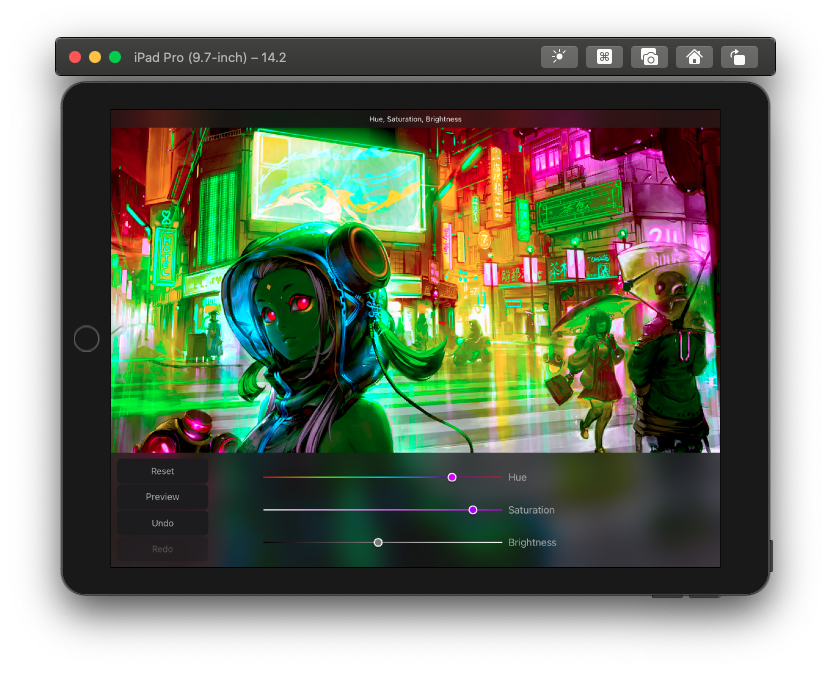

# tech-challenge

## Library used
[Snapkit](http://snapkit.io) - Simpler, easier, readable, more compact auto layout DSL.

## Documentation
1. iPhone supports
    - The app supports both iPhone and iPad (tested on iPhone 7 plus device, and iPad 9.8in on simulator). However, It is 'more' optimised for iPad since it was intended for iPad afterall.

2. Navbar is ignored
    - As mentioned by Joe, Navbar can be ignored - hence why it is not implemented.
    
3. Saturation slider improvement
    - I used Procreate pocket app as a reference (and to make sure i understand and implemented each functionality correctly and as intended). However, I noticed that the saturation slider was static and does not change with respect to the hue value.
    Therefore, I took the initiative to implement an improvement by reflecting what hue the user is currently at. Thus promoting good UX.

4. Preview implementation
    - Before Joe mentioned to me that I can implement the toolbar for a bonus. Before this, I implemented a simple long press on the image to preview it. (Just like VSCO, and any other photo editing app). After the mention, I then change it to how it is right now. I assumed by 'depressed' it's meant as a long-press too. So, long press to show initial photo, release to re-apply the filter(s).

5. Custom third party classes
    - I used two third party classes. Gradient Slider for better slider, and PaddingLabel for adding padding to label (for iPhone). Both are linked in comment above each class declaration.

